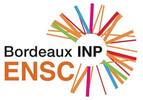

# Deep Learning introductory course (spring 2021)

[Ecole Nationale Supérieure de Cognitique](https://ensc.bordeaux-inp.fr)

## Outline

- [The Python ecosystem](https://www.bpesquet.fr/mlhandbook/overview/the_python_ecosystem.html)
- [Handling data](https://www.bpesquet.fr/mlhandbook/fundamentals/handling_data.html)
- [Training models](https://www.bpesquet.fr/mlhandbook/fundamentals/training_models.html)
- [NumPy](https://www.bpesquet.fr/mlhandbook/katas/data/numpy.html)
- [Artificial Neural Networks](https://www.bpesquet.fr/mlhandbook/algorithms/artificial_neural_networks.html)
- [Convolutional Neural Networks](https://www.bpesquet.fr/mlhandbook/algorithms/convolutional_neural_networks.html)
- [Fashion-MNIST](https://www.bpesquet.fr/mlhandbook/katas/training/fashion_mnist.html)
- [CIFAR10](https://www.bpesquet.fr/mlhandbook/katas/training/cifar10.html)
- [Dogs vs. cats](https://www.bpesquet.fr/mlhandbook/katas/training/dogs_vs_cats_keras.html)
